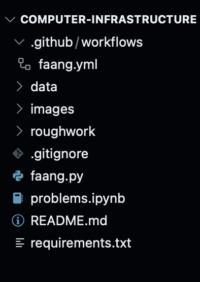

# Computer Infrastructure

Course project for the course **Computer Infrastructure** - Higher Diploma in Science in Computing in Data Analytics, ATU Galway Mayo (IE). 

## About this repository

### The project

The code in this repository automatically downloads and plots financial data from [Yahoo Finance](https://finance.yahoo.com/) using the Python library [yfinance](https://ranaroussi.github.io/yfinance/). 

### Getting started 

- **Use a codespace**: To avoid compaitibility issues, it is recommended to use MacOs or codespaces, when the code is executed (this is because the code uses a Shebang, which is usually ignored by Windows system).

- **Clone the repository**: Clone this repository using the HTTPS link (for more information, see [Cloning a repository](https://docs.github.com/en/repositories/creating-and-managing-repositories/cloning-a-repository)). 

- **Install python 3.12**: If it's not installed on your machine or virtual environment, install python 3.12: https://www.python.org/downloads/. 

- **Install the dependencies**: run *pip install -r requirements.txt* to install all the required libraries at once, or *pip install \*library name\* to install individual libraries. 

### Inside this repository 

This is the structure of the repositoy: 

**Relevant folders and files**: 

1. [faang.py](faang.py) is the main script
2. [data](data) and [images/plots](images/plots) are where the weekly data and plots are saved
3. [.gihub/worfklows](.github) includes the automation GitHub Action 
4. [problems.ipynb](problems.ipynb) is where each componend of the code is detailed and explained. 

## Problems 

This sections includes a breakdown of the components in this repository. Every component is explained in detail in [problems.ipynb](problems.ipynb). 

### 1. Data from yfinance

The python library Yfinance is used to download data from Yahoo Finance and save it in the folder [data](data), named with a timestamp. At the moment, the code downloads data from the *past 5 days* for the *FAANG stocks*(Facebook, Apple, Amazon, Netflix, Google), but the function can be adjusted to modify these parameters. 

### 2. Plotting the data 
The latest data dowloaded from Yfinance is located, and then read using the library Pandas. The data is manipulated to improve readability, and then relevant data is plotted. At the moment, the program plots: 
- a combined plot showing the hourly Close price in the last 5 days* for each FAANG stock, to compare trends.  
- subplots showing the EOD** Close price in the last 5 days* for each FAANG stock (separately), to better highlight individual performance. 

\* 5 working days 

\*\* End of Day

### 3. The script 

The functions created to download, save and plot the data from Yfinance are imported in the python file [faang.py](faang.py), that will later be used to automate the program. 
The focus of this part of the project is making the file executable. This means modifying file permissions, and using a Shebang line. 

### 4. Automation

GitHub actions is used to automate the code execution. This means that a workflow named [.faang.yml](.github/workflows/faang.yml) is created, so that the code is run every Saturday morning at 8:30AM (UTC), the data is saved and plotted, and the output pushed to the repository. 

## References 

### README
https://docs.github.com/en/get-started/writing-on-github/getting-started-with-writing-and-formatting-on-github/basic-writing-and-formatting-syntax 

### Problem 1 
yfinance: https://ranaroussi.github.io/yfinance/

yfinace API documentation: https://ranaroussi.github.io/yfinance/ 

yfinance download function: https://ranaroussi.github.io/yfinance/reference/api/yfinance.download.html#yfinance.download 

verify and create directories: https://stackoverflow.com/questions/273192/how-do-i-create-a-directory-and-any-missing-parent-directories  

python datetime: https://www.w3schools.com/python/python_datetime.asp 

pd.to_csv: https://pandas.pydata.org/docs/reference/api/pandas.DataFrame.to_csv.htm 

### Problem 2

os listdir: https://www.geeksforgeeks.org/python/python-os-listdir-method/ 

find latest file: https://stackoverflow.com/questions/39327032/how-to-get-the-latest-file-in-a-folder 

pandas time series: https://pandas.pydata.org/docs/user_guide/timeseries.html#overview 

pandas read_csv: https://pandas.pydata.org/pandas-docs/stable/reference/api/pandas.read_csv.html

view dataframe series: https://stackoverflow.com/questions/19482970/get-a-list-from-pandas-dataframe-column-headers 

pandas findall: https://pandas.pydata.org/docs/reference/api/pandas.Series.str.findall.html  

pandas df.head(): https://pandas.pydata.org/docs/reference/api/pandas.DataFrame.head.html  

pandas dataframe.plot(): https://pandas.pydata.org/docs/reference/api/pandas.DataFrame.plot.html

matplotlib legend: https://matplotlib.org/stable/api/_as_gen/matplotlib.pyplot.legend.html 

matplotlib xticks: https://matplotlib.org/stable/api/_as_gen/matplotlib.pyplot.xticks.html 

matplotlib subplots: https://chatgpt.com/share/6910e526-a2d0-800f-be66-94ac6a06bf9c  

matplotlib color mapping: https://chatgpt.com/s/t_6945a7de52d481918048246e9c76ee3d 

### Problem 3

python shebang: https://realpython.com/python-shebang/

file permissions: https://share.google/aimode/3Ibdw9179iM9uMZt0 

### Problem 4 

GitHub Actions: https://docs.github.com/en/actions/get-started/quickstart 

GitHub Actions first workflow: https://docs.github.com/en/actions/get-started/quickstart#creating-your-first-workflow 

GitHub workflow dispatch: https://docs.github.com/en/actions/how-tos/manage-workflow-runs/manually-run-a-workflow 

Cron jobs: https://cronitor.io/guides/cron-jobs

Crontab gutu: https://crontab.guru/ 

Github action by chatGPT: https://chatgpt.com/share/69440724-6820-800f-ab3e-ae20cb193cae 

Troubleshooting File Error: https://chatgpt.com/s/t_6944126f7db88191a2622cc79aad5bab

Troubleshooting Cron job delay: https://chatgpt.com/s/t_69441b434d3881919d0535f3a13249e2 

Cron job timezone: https://serverfault.com/questions/791713/what-time-zone-is-a-cron-job-using

### Other

Markdown tricks: https://stackoverflow.com/questions/50544499/github-flavored-markdown-how-to-make-a-styled-admonition-box-in-a-gist 